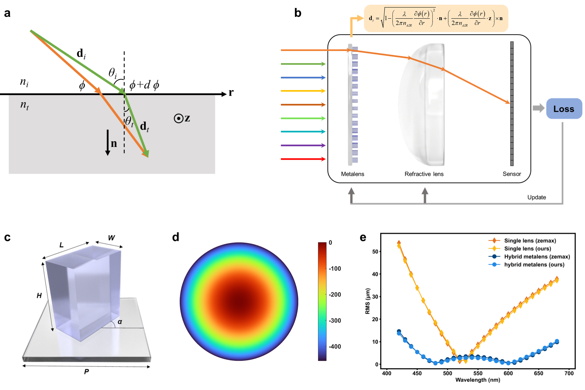

# Vectorial Generalized Snell's Law-Enabled Differentiable Ray Tracing for Large-Aperture Visible Achromatic Hybrid Meta-Optics

Qiangbo Zhang, Peicheng Lin, Zeqing Yu, Changwei Zhang, Yiyang Liu, Mengguang Wang, Qingbin Fan, Chang Wang, Ting Xu, and Zhenrong Zheng

[Paper](https://doi.org/10.1002/lpor.202500448) | Laser Photonics Rev 2025, e00448

This project implements differentiable ray tracing based on vectorial generalized Snell's law for the design and optimization of large-aperture visible achromatic hybrid meta-optical systems.

Our code is based on [DiffOptics](https://github.com/vccimaging/DiffOptics). We sincerely appreciate Dr. Congli Wang's work.



## Requirements

We ran the experiments in the following environment:
```
- Python: 3.8
- PyTorch: 1.10.2
- Matplotlib: 3.5.1
- SciPy: 1.8.0
```

## Project Structure

```
├── diffoptics/             # Core differentiable optics library
│   ├── optics.py           # Optical surface definitions and Generalized Snell's Law
│   ├── ...
├── demo/                   # Demonstration scripts
├── hybrid_optimize/        # Hybrid system optimization
└── generate_h5file/        # Tools for exporting data to h5 format compatible with Zemax
```


## Usage

### 1. Demonstration scripts
```bash
# Multi-wavelength (525-535nm)
cd demo
python Demo_Geometric_hyperboloidal_lambda525-535_fieldview0.py

# Multi-field angle (530nm)
cd demo
python Demo_Geometric_hyperboloidal_lambda530_fieldview0-15.py
```

### 2. Hybrid meta-optical system optimization
```bash
# Achromatic hybrid lens optimization
cd hybrid_optimize
python Optimize_Geometric_hybrid_achromatic.py

# Comparison analysis: Hybrid system vs Single lens
cd hybrid_optimize
python Load_optimized_Geometric_hybrid_vs_SingleLens.py
```

### 3. MATLAB data export
```matlab
% Export optimization results to h5 format for Zemax compatibility
cd generate_h5file
run rotation2d.m
```


## Citation

If you use this code, please cite our paper:

```bibtex
@article{zhang2025vectorial,
  title={Vectorial Generalized Snell's Law-Enabled Differentiable Ray Tracing for Large-Aperture Visible Achromatic Hybrid Meta-Optics},
  author={Zhang, Qiangbo and Lin, Peicheng and Yu, Zeqing and Zhang, Changwei and Liu, Yiyang and Wang, Mengguang and Fan, Qingbin and Wang, Chang and Xu, Ting and Zheng, Zhenrong},
  journal={Laser \& Photonics Reviews},
  pages={e00448},
  year={2025},
  publisher={Wiley-VCH},
  doi={10.1002/lpor.202500448}
}
```
